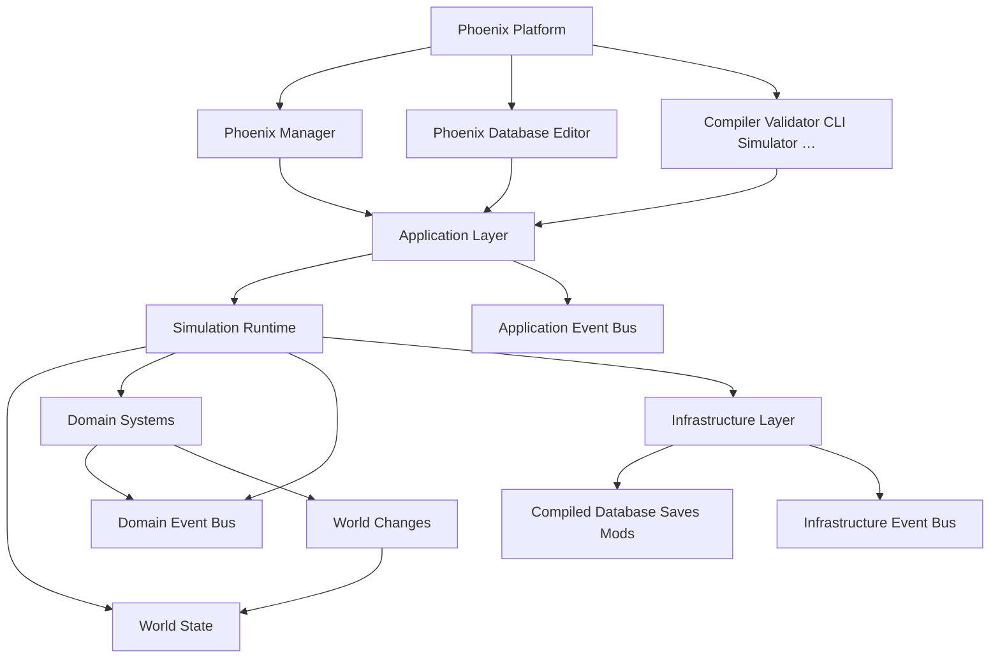

# Platform Overview

Planta da **Phoenix Platform**: define os módulos, responsabilidades e regras de comunicação.

Nenhum módulo pode ser criado fora desta arquitectura sem uma **ADR** em [`DECISIONS.md`](../DECISIONS.md).

Internamente o guarda-chuva é a **Phoenix Platform**. **Phoenix Manager** é só o jogo — uma das apps sobre a plataforma.

## Nomes (produtos)

Lista completa e inventário fino: [Platform Module Map](19-module-map.md).

```
Phoenix Platform
        │
        ├── Phoenix Manager
        ├── Phoenix Database Editor
        ├── Phoenix Scenario Editor
        ├── Phoenix Competition Editor
        ├── Phoenix Compiler
        ├── Phoenix Validator
        ├── Phoenix CLI
        ├── Phoenix Simulator
        ├── Phoenix Benchmark
        └── Futuras ferramentas
```

Módulo novo → categoria do Module Map; **categoria de topo** nova → ADR em [`DECISIONS.md`](../DECISIONS.md).

## Visão geral



## Os 10 macro-módulos

Tudo na plataforma pertence a **um** destes blocos.

### 1. Desktop Client → Phoenix Manager

Interface do jogo: navegação, componentes, janelas, UX (Electron + React).

**Nunca** contém regras do jogo.

### 2. Database Editor → Phoenix Database Editor

Programa independente: editar jogadores/clubes/competições, importar/exportar (validação e compilação podem usar Validator/Compiler).

### 3. Future Tools → Compiler, Validator, CLI, Simulator, …

Ferramentas auxiliares nomeadas (e futuras): compilação, validação, CLI, simulação automática, benchmarks, geradores, testes headless.

### 4. Application Layer

Traduz acções do utilizador em casos de uso e chama o Simulation Runtime.

Botão → caso de uso → Simulation Runtime.

**Não** conhece regras de futebol.

### 5. Simulation Runtime

Coração da plataforma: carregar mundo, iniciar carreira, avançar **Simulation Ticks**, coordenar Domain Systems via **Simulation Scheduler**.

Canónico: [Simulation Cycle](../16-processes/01-simulation-cycle.md) (Volume 5).

Systems **propõem World Changes**; não mutam o World State directamente. Validação global → Commit. Spec: [World Changes](../16-processes/02-world-changes.md).

### 6. World State

Fotografia actual do universo **em memória**: jogadores, clubes, técnicos, competições, calendário, contratos, …

Só actualizado após **Commit** de World Changes (Tick ou acção explícita do utilizador via Runtime).

### 7. Domain Systems

Inteligência de domínio em **Bounded Contexts** (Football, People, Finance, Media, …) — inventário em [Module Map](19-module-map.md). Cada system independente; comunicação só via **Domain Event Bus**; alterações só via World Changes.

Transfer · Finance · Youth · Training · Competition · Match · Media · Reputation · Weather · Awards · …

### 8. Event Buses

Três buses em Shared: **Domain**, **Application**, **Infrastructure**. Domain Systems comunicam **só** por Domain Events no Domain Event Bus.

Canónico: [Domain Events](../17-events/01-domain-events.md) · [Application Events](../17-events/02-application-events.md) · [Infrastructure Events](../17-events/03-infrastructure-events.md). Módulo: [07-event-system.md](07-event-system.md).

### 9. Infrastructure

Ficheiros, cache, logs, saves, mods, compilação, índices — I/O e cross-cutting técnico.

### 10. Compiled Database

Única fonte de dados usada pelo Runtime: entidades, índices, metadata, versões, hashes (+ saves/mods aplicados via Infrastructure).

## Fluxo: avançar um Tick

```
UI → Application → Simulation Runtime
  → Simulation Scheduler
  → Domain Systems (propõem World Changes + eventos)
  → Validação global → Commit → World State
  → UI actualiza
```

Systems não se encadeiam por chamadas internas; o Runtime/Scheduler coordena; o **Domain Event Bus** propaga efeitos; o World só muda no Commit.

Detalhe: [Simulation Cycle](../16-processes/01-simulation-cycle.md).

## Dependências (absolutas)

**Nunca:** UI → Database · Match → React · Finance → Electron.

Cada módulo comunica apenas por **interfaces públicas** (e **Domain Event Bus** entre Domain Systems).

## Filosofia

Cada módulo deve poder ser **substituído** (ex. Match System V1 → V2) sem alterar Transfer, Finance ou Interface.

## Escalabilidade prevista

Sem reestruturação: multiplayer, cloud save, workshop, API pública, mobile companion, editor avançado, servidor dedicado.

## Transição (6 camadas → 10 módulos)

| Antes (6 camadas) | Agora (módulo) |
|-------------------|----------------|
| UI | Phoenix Manager (+ Editor / Tools) |
| Application | Application Layer |
| Simulation Engine + load parcial | Simulation Runtime |
| World | World State |
| Systems | Domain Systems |
| Runtime (só load) + I/O | Infrastructure + Compiled Database |
| Eventos (satélite) | Event Buses (módulo 8) |

## Software vs plataforma

Organização de packages/monorepo: [Volume 7 — Software Architecture](../bible/07-software-architecture.md).

Ver também: [Platform Module Map](19-module-map.md) · [Dependências](05-dependencies.md) · [Fluxo de dados](06-data-flow.md) · [Event Bus](07-event-system.md) · [Simulation Cycle](../16-processes/01-simulation-cycle.md) · [Database Philosophy](../20-database/01-database.md) · [Volume 2 — Platform Architecture](../bible/02-platform-architecture.md) · [Volume 5 — Core Business Processes](../bible/05-core-business-processes.md)
