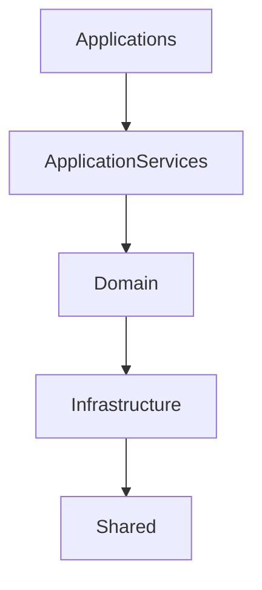

# Platform Module Map

Catálogo fino dos módulos da **Phoenix Platform**.

Cada módulo tem **uma** responsabilidade. Nenhum assume o papel de outro. Isto reduz acoplamento, facilita manutenção e o desenvolvimento assistido por IA.

A **planta** (10 macro-módulos) continua em [Platform Overview](01-overview.md). Este documento é o **inventário**. Módulo novo entra numa categoria daqui; **categoria de topo** nova exige ADR em [`DECISIONS.md`](../DECISIONS.md).

## Filosofia — quatro níveis

Cada nível depende apenas do nível imediatamente inferior:



Categorias irmãs do mapa (não são degraus da seta principal): **Database · Assets · Tooling**. São consumidas via Infrastructure / Applications conforme o caso; **Shared** fica na base.

## Mapa geral

```
Phoenix Platform
│
├── Applications
├── Application Services
├── Domain
├── Infrastructure
├── Database
├── Assets
├── Tooling
└── Shared
```

## Applications

Produtos finais. Utilizam a plataforma. **Nunca** implementam regras de futebol.

| Produto | Papel |
|---------|--------|
| Phoenix Manager | Jogo (Desktop Client) |
| Phoenix Database Editor | Editar / importar / exportar bases |
| Phoenix Scenario Editor | Cenários e setups de carreira |
| Phoenix Competition Editor | Estruturas de competição |
| Phoenix CLI | Linha de comandos |
| Phoenix Validator | Validação de bases (produto) |
| Phoenix Compiler | Compilação de bases (produto) |
| Phoenix Simulator | Simulation Runner / simulação automática |
| Phoenix Benchmark | Benchmarks e stress |

Produto ≠ serviço de Infrastructure: o Compiler/Validator *app* chama os serviços de compilação/validação.

## Application Services

Casos de uso. Coordenam Domain Systems; **não** implementam regras profundas de futebol.

**Simulation Runtime** — orquestrador de **Simulation Ticks** (Scheduler + World Changes + Commit). Canónico: [Simulation Cycle](../16-processes/01-simulation-cycle.md).

Use cases (inventário inicial):

- Create Career · Load Save · Save Game
- Advance Tick · Advance Week · Advance Month (mapeados a N ticks)
- Sign Player · Release Player · Renew Contract
- Fire Manager · Hire Manager
- Start Match · Finish Match
- Generate Season
- Import Database · Export Database

## Domain

O Domain organiza-se em **Bounded Contexts** (DDD) — não em pastas nem packages. Cada contexto tem linguagem ubíqua própria e limites claros. Integração entre contextos: **Domain Event Bus** e IDs — nunca objectos partilhados nem chamadas internas ([Event Buses](07-event-system.md)).

**World State** (Doc 01) = fotografia em memória; só actualizado após Commit de World Changes. Atravessa contextos via IDs, sem fundir contextos.

### People Context

**Human** (+ especializações). O **Player** não concentra tudo — é o ponto de união de BCs: Identity · Development · Health · Career · Social — [Player Entity](../15-domain/04-player.md).

Player · Manager · Staff · Referee · Agent · Journalist · Owner · Scout

### Football Context

**Organization/Club**, **Place/Stadium**, **Competition** (+ League/Cup/…); Relationships: CompetitionEntry, Match, Fixture.

Club · Squad · Formation · Tactic · Competition · League · Cup · Stage · Match · Fixture · CompetitionEntry

### Finance Context

**Organization** (Club, Sponsor, Agency, …); Contracts: EmploymentContract, LoanContract, SponsorshipContract, StadiumUsageAgreement — [Contract Aggregate](../15-domain/06-contract-aggregate.md).

**Contract** = eixo do domínio ([eixo](../15-domain/05-contract.md)): salários e plantel laboral fluem daí — não de `clubId` embutido. Status só via Lifecycle do Aggregate.

Budget · Salary · Transfer Fees · Transfer · Prize Money · Ticket Revenue · Finance (ledger)

### Media Context

News · Articles · Awards · History · Statistics · Records

### World Context

World · Timeline · Calendar · Season · Universe

### Development Context

Sistemas de **processo** (treino, academia, scouting) — distintos dos BCs de estado do Player:

| Player BC (People) | Processo (este contexto) |
|--------------------|--------------------------|
| Player Development | Training · Youth Academy · Potential pipelines |
| Player Health | Medical · Recovery (operações / calendário) |
| — | Scouting |

Estado do jogador vive nos BCs Identity/Development/Health/Career/Social; estes módulos *actuam* sobre esse estado via eventos.

### Reputation Context

Club Reputation · Player Reputation · Manager Reputation · League Reputation · Nation Reputation

### AI Context

Club AI · Transfer AI · Finance AI · Youth AI · Lineup AI · Manager AI

(Cada AI respeita o Bounded Context que decide — não “lê pastas” de outros contextos; consome eventos / views públicas.)

## Infrastructure

I/O e cross-cutting técnico. Apps e Runtime usam estes **serviços** (não confundir com produtos homónimos).

Database Loader · Database Compiler (serviço) · Repository · Cache · Serializer · Save Loader · Save Writer · Import · Export · Validation (serviço) · Logging · Metrics · Configuration

## Database

Fonte compilada e metadados.

Compiled Database · Schemas · Indexes · Metadata · Version · Dependencies

## Assets

Flags · Club Logos · Competition Logos · Player Faces · Stadium Images · Fonts · Icons · Themes

## Tooling

Ferramentas internas (distintas dos produtos Applications quando forem só internas).

Database Validator · Benchmark · Migration Tool · Integrity Checker · Performance Profiler · Scenario Generator · Random Database Generator · Translation Extractor

## Shared

Reutilizável por todos os níveis acima.

Utilities · Types · Constants · Math · Random · Date · Collections · **Events** (DomainEventBus · ApplicationEventBus · InfrastructureEventBus — Doc 01 módulo 8)

## Dependências permitidas

```
Applications → Application Services → Domain → Infrastructure → Shared
```

Nunca o contrário. Detalhe: [Dependências](05-dependencies.md).

## Dependências proibidas (exemplos)

| De | Para |
|----|------|
| Player (Domain) | React |
| Transfer AI | Electron |
| Finance | Database Loader (salto indevido / acoplamento I/O) |
| UI | Compiled Database (acesso directo) |

## Regras de cada módulo

Todo o módulo responde:

1. O que faz?
2. O que não faz?
3. De quem depende?
4. Quem depende dele?
5. Que eventos publica?
6. Que eventos consome?

Nenhum módulo existe sem estas respostas (ficha completa nos docs do system / packages — Volume 4).

## Identificação

| Campo | Conteúdo |
|-------|----------|
| ID | `{type}:{ulid}` |
| Nome | display |
| Descrição | uma frase |
| Owner | Bounded Context / maintainer |
| Dependências | módulos / níveis |
| Eventos emitidos / recebidos | contratos |
| Interfaces públicas | API estável |
| Testes | onde vivem |

### Template

```
ID: …
Nome: …
Descrição: …
Owner: …
Depende de: …
Dependido por: …
Emite: …
Consome: …
Interfaces: …
Testes: …
```

### Exemplo — Transfer (Finance Context)

| Campo | Valor |
|-------|--------|
| ID | `transfer` |
| Nome | Transfer |
| Descrição | Negocia e conclui movimentos de jogadores entre clubes |
| Owner | Finance Context |
| Depende de | World State (IDs), Shared/Events; contratos no próprio contexto |
| Dependido por | Application Services (Sign Player, …); outros contextos só via eventos |
| Emite | `player.transferred`, `contract.created`, … |
| Consome | (conforme regras do mercado) |
| Interfaces | API pública do Transfer System |
| Testes | package do system / Volume 4 |

## Overview ↔ Module Map

| Doc 01 (macro) | Module Map |
|----------------|------------|
| Desktop Client | Applications / Phoenix Manager |
| Database Editor | Applications / Phoenix Database Editor |
| Future Tools | Applications + Tooling |
| Application Layer | Application Services (use cases) |
| Simulation Runtime | Application Services / Simulation Runtime — [Simulation Cycle](../16-processes/01-simulation-cycle.md) |
| World State | Domain — estado em memória (só via Commit de World Changes) |
| World Changes | Propostas de alteração; validação → Commit — [02-world-changes.md](../16-processes/02-world-changes.md) |
| Simulation Scheduler | Que systems / ordem / frequência por Tick |
| RandomService | Única fonte de aleatório (seed / reprodutibilidade) |
| Domain Systems | Domain (Bounded Contexts) |
| Event Buses | Shared / Events — `DomainEventBus` · `ApplicationEventBus` · `InfrastructureEventBus`; contratos: [Domain](../17-events/01-domain-events.md) · [Application](../17-events/02-application-events.md) · [Infrastructure](../17-events/03-infrastructure-events.md) |
| Infrastructure | Infrastructure |
| Compiled Database | Database |

## Estrutura futura (ordem de grandeza)

| Categoria | Nº estimado |
|-----------|-------------|
| Applications | 8 |
| Application Services | 30 |
| Domain Systems | 40 |
| Infrastructure Services | 20 |
| Shared Libraries | 15 |
| Database Modules | 10 |
| Tooling | 15 |
| **Total** | **≈138** |

Cada módulo pequeno, focado e testável.

## Benefícios

Desenvolvimento paralelo · substituição de componentes · testes independentes · produtividade com IA · manutenção · reutilização entre ferramentas.

Ver também: [Platform Overview](01-overview.md) · [Dependências](05-dependencies.md) · [Event Buses](07-event-system.md) · [Domain Model](../15-domain/01-overview.md) · [Volume 2](../bible/02-platform-architecture.md) · [Volume 7 — Software Architecture](../bible/07-software-architecture.md)
