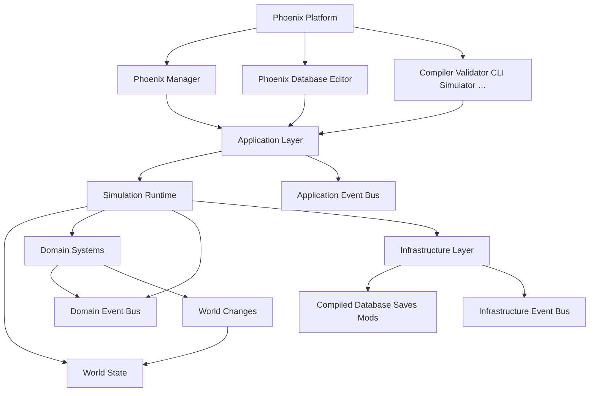

# Three-Level Event Buses — Implementation Plan

> **For agentic workers:** REQUIRED SUB-SKILL: Use superpowers:subagent-driven-development (recommended) or superpowers:executing-plans to implement this plan task-by-task. Steps use checkbox (`- [ ]`) syntax for tracking.

**Goal:** Update Phoenix Platform documentation so Event Bus is three physical buses (Domain, Application, Infrastructure) with strict per-layer access — contract only, no code.

**Architecture:** Shared owns three transport names; each level has its own event contract doc; Module Map / Overview / AGENTS / ADR align with the approved design.

**Tech Stack:** Markdown docs under `docs/` (no TypeScript, no Flutter).

## Global Constraints

- Spec: `docs/superpowers/specs/2026-07-22-three-level-event-buses-design.md`
- Three physical buses: `DomainEventBus`, `ApplicationEventBus`, `InfrastructureEventBus`
- Strict access: each layer publishes and subscribes only on its own bus; no implicit bridging
- Documentation only — no packages, no Flutter migration
- Events: past-tense PascalCase, immutable, no logic; Domain Events ≠ World Changes
- Domain bus: sync within Tick; App/Infra: sync by default, no mandatory replay / Domain Event Log
- Language: Portuguese for narrative docs (match existing docs); type/event names in English PascalCase

## File map

| Path | Responsibility |
|------|----------------|
| `docs/10-architecture/07-event-system.md` | Canonical module doc: three buses + access matrix |
| `docs/17-events/02-application-events.md` | Application event contract + inventory |
| `docs/17-events/03-infrastructure-events.md` | Infrastructure event contract + inventory |
| `docs/17-events/01-domain-events.md` | Clarify Domain Bus only; rename “Event Bus” → Domain Event Bus where needed |
| `docs/bible/06-event-driven-architecture.md` | Index all three contracts |
| `docs/10-architecture/01-overview.md` | Macro-módulo 8 + diagram: three buses |
| `docs/10-architecture/19-module-map.md` | Shared/Events = three buses; glossary row |
| `docs/AGENTS.md` | Domain Systems ↔ Domain Event Bus |
| `docs/DECISIONS.md` | ADR entry |
| `docs/README.md` | Point 17-events at volume (optional one-line if needed) |

---

### Task 1: Rewrite Event Bus module (`07-event-system.md`)

**Files:**
- Modify: `docs/10-architecture/07-event-system.md`
- Test: verification via `rg` (no unit tests)

**Interfaces:**
- Consumes: decisions from design spec
- Produces: canonical wording for “three buses” + access matrix used by later tasks

- [ ] **Step 1: Replace `docs/10-architecture/07-event-system.md` with the following full content**

```markdown
# Event Buses

**Módulo 8** da [Platform Overview](01-overview.md).

A plataforma tem **três** Event Buses físicos (transporte em Shared / Events). Não existe um bus global único.

| Bus | Contrato | Quem publica | Quem consome |
|-----|----------|--------------|--------------|
| Domain Event Bus | [Domain Events](../17-events/01-domain-events.md) | Domain Systems / Aggregates | Domain Systems |
| Application Event Bus | [Application Events](../17-events/02-application-events.md) | Application Services (+ adapters de app) | Application Services / UI adapters da app |
| Infrastructure Event Bus | [Infrastructure Events](../17-events/03-infrastructure-events.md) | Packages de Infrastructure | Packages de Infrastructure |

Transporte (cada bus): receber · distribuir · ordenar · monitorizar · guardar (opcional, conforme o nível).

## Regras de acesso (estritas)

- Cada camada **só** publica no seu bus.
- Cada camada **só** consome do seu bus.
- **Proibido** bridging implícito entre buses. Cruzamentos futuros exigem design explícito (ADR).
- Ninguém chama outro Domain System directamente — só **Domain Event Bus**.
- Application / Infrastructure **não** mutam World State via o seu bus.

## Domain

Única via de comunicação entre **Domain Systems**.

Alterações de estado: systems propõem **World Changes**. O Domain Event Bus propaga *notificações* (Domain Events) — eventos **não** mutam entidades.

```
Transfer System → Domain Event → Domain Event Bus → Finance, Media, Morale, History, …
```

O Simulation Runtime + **Simulation Scheduler** decidem *quando* os systems correm; o Domain Event Bus propaga *efeitos* entre eles.

Semântica: entrega síncrona dentro do Tick; ordenação causal; vida útil normal = Tick (debug/replay pode reter Domain Event Log).

## Application

Acontecimentos de sessão / app / UI (não regras de futebol). Ex.: `SaveLoaded`, `SettingsChanged`.

Semântica: síncrono por omissão; sem replay obrigatório; **não** entra no Domain Event Log.

## Infrastructure

Sinais técnicos. Ex.: `DatabaseCompiled`, `CacheInvalidated`, `BackupCompleted`.

Semântica: síncrono por omissão; sem replay obrigatório; **não** entra no Domain Event Log.

## Princípios (todos os níveis)

- Eventos tipados, imutáveis, no passado (`PlayerTransferred`, não `TransferPlayer`)
- Consumidores registam-se sem conhecer o emissor
- Sem mutação directa do World State — só World Changes (domínio)
- Eventos ≠ World Changes
- Novos eventos entram no inventário do nível **antes** do código

Ver: [Domain Events](../17-events/01-domain-events.md) · [Application Events](../17-events/02-application-events.md) · [Infrastructure Events](../17-events/03-infrastructure-events.md) · [World Changes](../16-processes/02-world-changes.md) · [Volume 6](../bible/06-event-driven-architecture.md) · [Volume 5](../bible/05-core-business-processes.md)

Ver também: [Platform Overview](01-overview.md) · [Fluxo de dados](06-data-flow.md) · [Design](../superpowers/specs/2026-07-22-three-level-event-buses-design.md)
```

- [ ] **Step 2: Verify file exists and names the three buses**

Run:

```bash
rg -n "Domain Event Bus|Application Event Bus|Infrastructure Event Bus" docs/10-architecture/07-event-system.md
```

Expected: at least one hit for each of the three names; title `# Event Buses`.

- [ ] **Step 3: Commit**

```bash
git add docs/10-architecture/07-event-system.md
git commit -m "$(cat <<'EOF'
docs: redefine Event Bus module as three buses

EOF
)"
```

---

### Task 2: Create Application + Infrastructure event contracts

**Files:**
- Create: `docs/17-events/02-application-events.md`
- Create: `docs/17-events/03-infrastructure-events.md`

**Interfaces:**
- Consumes: links to `07-event-system.md` from Task 1
- Produces: contract paths referenced by bible / domain / map tasks

- [ ] **Step 1: Create `docs/17-events/02-application-events.md`**

```markdown
# Application Events

Acontecimentos da **aplicação** (sessão, settings, UI) — não regras de futebol.

Volume: [Event-Driven Architecture](../bible/06-event-driven-architecture.md). Transporte: [Application Event Bus](../10-architecture/07-event-system.md).

## Objetivo

Contrato de Application Events: o que é, quem publica/consome, e o que um evento **nunca** faz.

## Quem publica / consome

| Papel | Actores |
|-------|---------|
| Publica | Application Services (+ adapters de app) |
| Consome | Application Services / UI adapters da app |

**Não** usam este bus: Domain Systems, packages de Infrastructure.

## O que é um Application Event

Algo que **já aconteceu** na app. Nunca um comando.

| Correcto | Errado |
|----------|--------|
| SaveLoaded | LoadSave |
| SettingsChanged | ChangeSettings |
| ThemeChanged | SetTheme |

## Imutabilidade

Depois de criado, o evento **nunca** muda.

## Inventário inicial

### Sessão / carreira

SaveLoaded · SaveSaved · CareerStarted · CareerAbandoned

### Preferências

SettingsChanged · ThemeChanged · LocaleChanged

Novos eventos entram neste inventário (ou na Ubiquitous Language da app) **antes** do código.

## Regras

Application Events **nunca**:

- alteram World State / entidades de domínio;
- executam lógica de negócio de futebol;
- são publicados no Domain Event Bus ou Infrastructure Event Bus.

Apenas informam a camada de aplicação.

## Semântica

- Entrega síncrona por omissão
- Sem replay obrigatório
- **Não** entram no Domain Event Log

## Convenções

Passado PascalCase: `SaveLoaded`, `SettingsChanged`.

## Pontes

| Tema | Documento |
|------|-----------|
| Volume | [06-event-driven-architecture.md](../bible/06-event-driven-architecture.md) |
| Event Buses | [07-event-system.md](../10-architecture/07-event-system.md) |
| Domain Events | [01-domain-events.md](01-domain-events.md) |
| Design | [2026-07-22-three-level-event-buses-design.md](../superpowers/specs/2026-07-22-three-level-event-buses-design.md) |
```

- [ ] **Step 2: Create `docs/17-events/03-infrastructure-events.md`**

```markdown
# Infrastructure Events

Acontecimentos **técnicos** da plataforma (I/O, compile, cache, backup).

Volume: [Event-Driven Architecture](../bible/06-event-driven-architecture.md). Transporte: [Infrastructure Event Bus](../10-architecture/07-event-system.md).

## Objetivo

Contrato de Infrastructure Events: o que é, quem publica/consome, e o que um evento **nunca** faz.

## Quem publica / consome

| Papel | Actores |
|-------|---------|
| Publica | Packages de Infrastructure |
| Consome | Packages de Infrastructure |

**Não** usam este bus: Domain Systems, Application Services / UI (excepto via bridge futuro explícito — fora de âmbito).

## O que é um Infrastructure Event

Algo técnico que **já aconteceu**. Nunca um comando.

| Correcto | Errado |
|----------|--------|
| DatabaseCompiled | CompileDatabase |
| CacheInvalidated | InvalidateCache |
| BackupCompleted | RunBackup |

## Imutabilidade

Depois de criado, o evento **nunca** muda.

## Inventário inicial

### Database / mods

DatabaseCompiled · DatabaseValidated · ModPackMounted

### Ops

CacheInvalidated · BackupCompleted

Novos eventos entram neste inventário **antes** do código.

## Regras

Infrastructure Events **nunca**:

- alteram World State / entidades de domínio;
- executam regras de futebol;
- são publicados no Domain Event Bus ou Application Event Bus.

## Semântica

- Entrega síncrona por omissão
- Sem replay obrigatório
- **Não** entram no Domain Event Log

## Convenções

Passado PascalCase: `DatabaseCompiled`, `BackupCompleted`.

## Pontes

| Tema | Documento |
|------|-----------|
| Volume | [06-event-driven-architecture.md](../bible/06-event-driven-architecture.md) |
| Event Buses | [07-event-system.md](../10-architecture/07-event-system.md) |
| Domain Events | [01-domain-events.md](01-domain-events.md) |
| Design | [2026-07-22-three-level-event-buses-design.md](../superpowers/specs/2026-07-22-three-level-event-buses-design.md) |
```

- [ ] **Step 3: Verify both files and inventories**

Run:

```bash
test -f docs/17-events/02-application-events.md && test -f docs/17-events/03-infrastructure-events.md
rg -n "SaveLoaded|DatabaseCompiled" docs/17-events/02-application-events.md docs/17-events/03-infrastructure-events.md
```

Expected: both files exist; `SaveLoaded` in application doc; `DatabaseCompiled` in infrastructure doc.

- [ ] **Step 4: Commit**

```bash
git add docs/17-events/02-application-events.md docs/17-events/03-infrastructure-events.md
git commit -m "$(cat <<'EOF'
docs: add application and infrastructure event contracts

EOF
)"
```

---

### Task 3: Align Domain Events doc + Volume 6 bible

**Files:**
- Modify: `docs/17-events/01-domain-events.md`
- Modify: `docs/bible/06-event-driven-architecture.md`

**Interfaces:**
- Consumes: paths from Tasks 1–2
- Produces: Volume 6 index with three rows

- [ ] **Step 1: Patch `docs/17-events/01-domain-events.md` — opening + diagrams**

Replace the first ~48 lines (from title through “Eventos **informam**…”) so Domain is explicit about **Domain Event Bus** only:

1. Change line 5 from “via Event Bus” to “via **Domain Event Bus**”.
2. Change line 7 “Transporte: [Event Bus]” to “Transporte: [Domain Event Bus](../10-architecture/07-event-system.md)”.
3. In the “Correcto” ASCII diagram, change `Event Bus` to `Domain Event Bus`.
4. In “Arquitectura”, change `Domain Event ──► Event Bus ──► Subscribers` to `Domain Event ──► Domain Event Bus ──► Subscribers (Domain Systems)`.
5. Add a short note after that diagram:

```markdown
Application Events e Infrastructure Events usam **outros** buses — ver [Application Events](02-application-events.md) e [Infrastructure Events](03-infrastructure-events.md). Não misturar níveis.
```

6. In section “## Event Bus”, rename heading to `## Domain Event Bus` and first sentence to say Domain Event Bus (Shared / Events). Keep responsibilities list. Link to `07-event-system.md`.

7. In “## Pontes” table, ensure Event Bus row points to `07-event-system.md` and add rows for Application / Infrastructure event docs.

Do **not** delete the domain inventory (World / Contract / Player / …).

- [ ] **Step 2: Replace `docs/bible/06-event-driven-architecture.md` with**

```markdown
# Volume 6 — Event-Driven Architecture

**Como a comunicação interna da plataforma acontece?**

Há **três** Event Buses (Domain · Application · Infrastructure). Domain Systems não se chamam uns aos outros — publicam e consomem **Domain Events** via **Domain Event Bus**.

Não confundir com [Volume 2 — Platform Architecture](02-platform-architecture.md) (módulo Event Buses), [Volume 5 — Core Business Processes](05-core-business-processes.md) (Tick / World Changes) nem [Volume 7 — Software Architecture](07-software-architecture.md) (packages).

| # | Título | Documento |
|---|--------|-----------|
| 01 | Domain Events | [01-domain-events.md](../17-events/01-domain-events.md) |
| 02 | Application Events | [02-application-events.md](../17-events/02-application-events.md) |
| 03 | Infrastructure Events | [03-infrastructure-events.md](../17-events/03-infrastructure-events.md) |

Transporte (módulo 8): [Event Buses](../10-architecture/07-event-system.md). Design: [three-level event buses](../superpowers/specs/2026-07-22-three-level-event-buses-design.md).

← [Architecture Bible](README.md)
```

- [ ] **Step 3: Verify Volume 6 lists three contracts and Domain doc says Domain Event Bus**

Run:

```bash
rg -n "02-application-events|03-infrastructure-events|Domain Event Bus" docs/bible/06-event-driven-architecture.md docs/17-events/01-domain-events.md
```

Expected: bible has both new links; domain doc contains `Domain Event Bus`.

- [ ] **Step 4: Commit**

```bash
git add docs/17-events/01-domain-events.md docs/bible/06-event-driven-architecture.md
git commit -m "$(cat <<'EOF'
docs: align Volume 6 and Domain Events with three buses

EOF
)"
```

---

### Task 4: Platform Overview + Module Map + AGENTS

**Files:**
- Modify: `docs/10-architecture/01-overview.md`
- Modify: `docs/10-architecture/19-module-map.md`
- Modify: `docs/AGENTS.md`

**Interfaces:**
- Consumes: wording from Task 1
- Produces: consistent “Domain Event Bus” in planta / mapa / agent rules

- [ ] **Step 1: Update mermaid + módulo 8 in `docs/10-architecture/01-overview.md`**

In the mermaid diagram (~lines 32–62):

- Change `Bus[Event Bus]` to three nodes:

```mermaid
  DomainBus[Domain Event Bus]
  AppBus[Application Event Bus]
  InfraBus[Infrastructure Event Bus]
```

- Replace edges that used `Bus`:
  - `SimRT --> DomainBus`
  - `Systems --> DomainBus`
  - Remove `Bus --> World` if present (events don’t write World); keep `Systems --> Changes` and `Changes --> World`
  - `Infra --> InfraBus` (Infrastructure may publish/consume infra events)
  - `App --> AppBus` (Application Layer may use application bus)

Exact replacement for the diagram block:



Then update prose:

- §7 Domain Systems: “comunicação só via **Domain Event Bus**”
- §8 retitle to `### 8. Event Buses` and body:

```markdown
### 8. Event Buses

Três buses em Shared: **Domain**, **Application**, **Infrastructure**. Domain Systems comunicam **só** por Domain Events no Domain Event Bus.

Canónico: [Domain Events](../17-events/01-domain-events.md) · [Application Events](../17-events/02-application-events.md) · [Infrastructure Events](../17-events/03-infrastructure-events.md). Módulo: [07-event-system.md](07-event-system.md).
```

- Tick flow line: “o **Domain Event Bus** propaga efeitos”
- Dependências: “e **Domain Event Bus** entre Domain Systems”
- Transition table row: `Eventos (satélite) | Event Buses (módulo 8)`

- [ ] **Step 2: Update `docs/10-architecture/19-module-map.md`**

Replace these occurrences:

1. Line ~76: `Integração entre contextos: **Domain Event Bus** e IDs` + link `07-event-system.md`
2. Shared section (~156): `**Events** (DomainEventBus · ApplicationEventBus · InfrastructureEventBus — Doc 01 módulo 8)`
3. Glossary table row (~245):

```markdown
| Event Buses | Shared / Events — `DomainEventBus` · `ApplicationEventBus` · `InfrastructureEventBus`; contratos: [Domain](../17-events/01-domain-events.md) · [Application](../17-events/02-application-events.md) · [Infrastructure](../17-events/03-infrastructure-events.md) |
```

4. Footer “Ver também”: keep link text `Event Buses` → `07-event-system.md`

- [ ] **Step 3: Update `docs/AGENTS.md` paragraph 1**

In the long Domain Events sentence, change:

`só Event Bus entre systems`

to:

`só Domain Event Bus entre Domain Systems; Application/Infrastructure usam os seus próprios buses`

Keep the rest of the paragraph intact (including link to `17-events/01-domain-events.md`). Optionally append `02`/`03` after the Vol 6 mention:

`Domain Events = Vol 6 (\`17-events/01-domain-events.md\`, \`02-application-events.md\`, \`03-infrastructure-events.md\`)`

- [ ] **Step 4: Consistency check**

Run:

```bash
rg -n "comunicação só via Event Bus|só Event Bus entre systems|Bus\[Event Bus\]" docs/10-architecture/01-overview.md docs/10-architecture/19-module-map.md docs/AGENTS.md
rg -n "Domain Event Bus|Application Event Bus|Infrastructure Event Bus|DomainEventBus" docs/10-architecture/01-overview.md docs/10-architecture/19-module-map.md docs/AGENTS.md
```

Expected: first command finds **no** matches; second finds hits in all three files.

- [ ] **Step 5: Commit**

```bash
git add docs/10-architecture/01-overview.md docs/10-architecture/19-module-map.md docs/AGENTS.md
git commit -m "$(cat <<'EOF'
docs: update overview, module map, and AGENTS for three buses

EOF
)"
```

---

### Task 5: ADR + final consistency sweep

**Files:**
- Modify: `docs/DECISIONS.md` (prepend new entry after the `---` following “## Formato”)
- Modify: `docs/README.md` only if the 17-events blurb still implies a single bus

**Interfaces:**
- Consumes: full decision set from design spec
- Produces: ADR + clean `rg` sweep

- [ ] **Step 1: Insert ADR at the top of entries in `docs/DECISIONS.md`**

Immediately after the first `---` that follows the Formato section (before the existing `## 2026-07-21` Electron entry), insert:

```markdown
## 2026-07-22

Decisão:

Três Event Buses físicos — **DomainEventBus**, **ApplicationEventBus**, **InfrastructureEventBus** — com regras estritas de publicação/consumo por camada. Transportes em Shared / Events; contratos em `docs/17-events/01|02|03-*.md`.

Motivo:

Um único bus mistura factos de domínio (futebol), de aplicação (save/settings) e técnicos (compile/cache), enfraquecendo Bounded Contexts e a regra “Domain Systems só via eventos de domínio”.

Alternativas:

- Um bus tipado com união `Domain | Application | Infrastructure` (menos isolamento)
- Híbrido: Domain dedicado + App/Infra no mesmo canal
- Buses definidos só dentro de cada camada sem API partilhada em Shared (implementações divergentes)

Consequências futuras:

Documentação e código futuro usam três APIs; bridging entre buses exige ADR; Flutter legado `EventBus` classifica-se depois (fora deste ADR). Spec: [2026-07-22-three-level-event-buses-design.md](superpowers/specs/2026-07-22-three-level-event-buses-design.md).

Resultado:

Três buses + acesso estrito adoptados no contrato da plataforma.
```

- [ ] **Step 2: Fix `docs/README.md` row for 17-events if needed**

Current:

`| [17-events/](17-events/01-domain-events.md) | Event-Driven Architecture (Volume 6) |`

Change description to:

`| [17-events/](17-events/01-domain-events.md) | Event-Driven Architecture (Volume 6) — Domain · Application · Infrastructure |`

- [ ] **Step 3: Repo-wide consistency sweep (docs)**

Run:

```bash
rg -n "via Event Bus|único Event Bus|um Event Bus|só Event Bus entre systems" docs --glob '!docs/legacy/**' --glob '!docs/superpowers/**'
rg -n "DomainEventBus|ApplicationEventBus|Infrastructure Event Bus|Domain Event Bus" docs/10-architecture/07-event-system.md docs/17-events docs/bible/06-event-driven-architecture.md docs/DECISIONS.md
```

Expected:

- First command: no remaining false “single bus” claims in architecture/bible/agents (legacy Flutter docs under `docs/legacy` may still say Event Bus — leave them).
- Second command: hits in the new/updated canonical files.

If the first command hits a file in scope of this plan with outdated wording, fix it in the same commit.

- [ ] **Step 4: Mark design status**

In `docs/superpowers/specs/2026-07-22-three-level-event-buses-design.md`, change:

`**Status:** Approved (pending user review of this file)`

to:

`**Status:** Approved — docs delivery planned in \`docs/superpowers/plans/2026-07-22-three-level-event-buses.md\``

- [ ] **Step 5: Commit**

```bash
git add docs/DECISIONS.md docs/README.md docs/superpowers/specs/2026-07-22-three-level-event-buses-design.md
git commit -m "$(cat <<'EOF'
docs: ADR for three-level event buses and consistency sweep

EOF
)"
```

---

## Spec coverage (self-review)

| Spec requirement | Task |
|------------------|------|
| Three physical buses in Shared | 1, 4 |
| Strict access matrix | 1, 2, 3 |
| Application + Infrastructure contracts + inventories | 2 |
| Domain doc clarifies Domain-only | 3 |
| Volume 6 indexes three contracts | 3 |
| Overview diagram + module 8 | 4 |
| Module Map Shared/Events + glossary | 4 |
| AGENTS wording | 4 |
| ADR in DECISIONS | 5 |
| Docs-only / no TS / no Flutter | Global + all tasks |
| Success criteria (consistent docs) | 5 sweep |

## Placeholder scan

None — all file bodies and commands are concrete.
